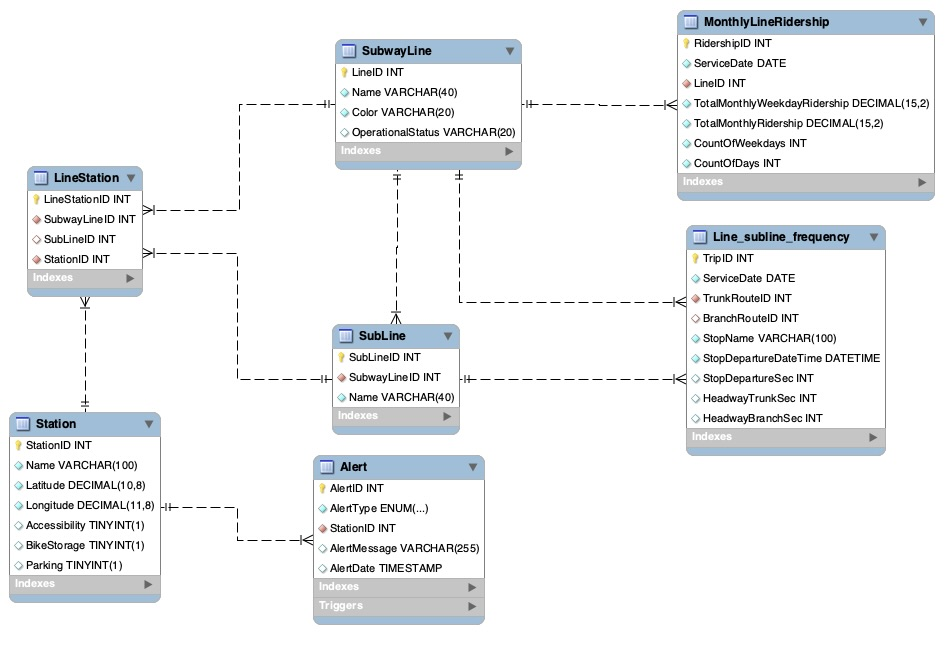

# Massachusetts Bay Transportation Authority (MBTA)

## Overview
This project is a database and analytics system designed to manage and analyze Massachusetts Bay Transportation Authority (MBTA) subway data. It incorporates features such as stored procedures for user interaction, role-based access control, triggers for automation, and analytics views for comprehensive insights. 

## Schema

# Getting Started
## Prerequisites
	•	MySQL Server
	•	MySQL Workbench
	•	Python (Optional for data preprocessing)

## Run the SQL Dump files in the order of:
- DDL_dump.sql
- DML_dump.sql
- DB_Objects.sql
- DCL_dump.sql

